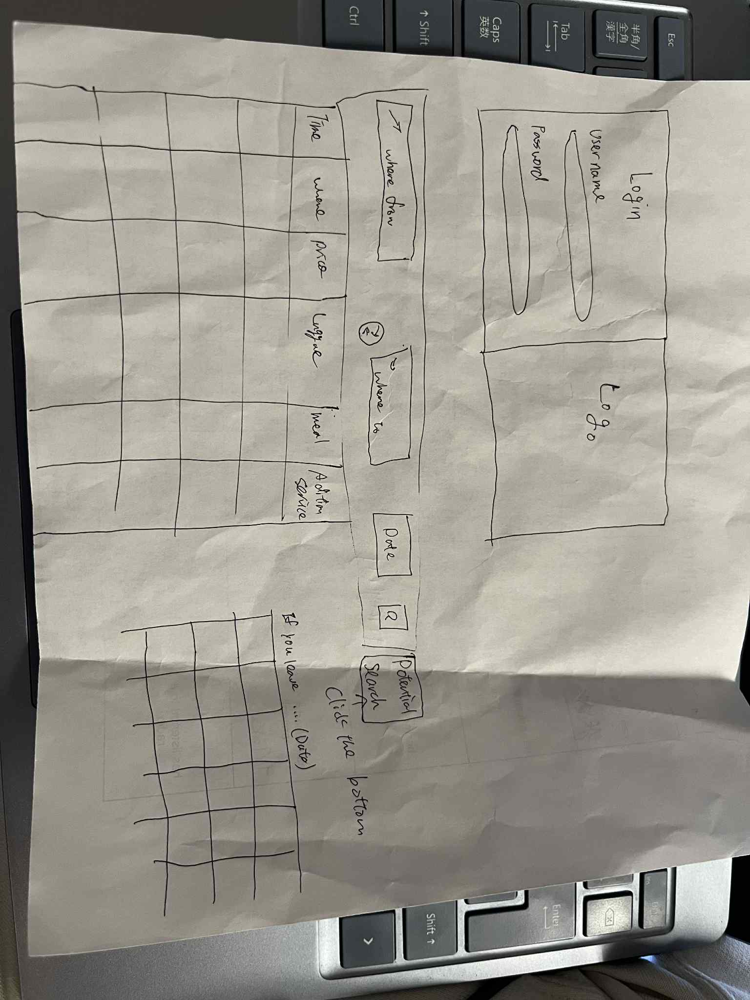

# Yuto Akatsuka

[My Notes](notes.md)

>DietBuilder helps users calculate their Recommended Dietary Allowances (RDA) from their height, weight, and goals. By logging meals, it highlights nutrient gaps and makes nutrition tracking simple.

<!--  A brief description of the application here. Lorem ipsum dolor sit amet, consectetur adipiscing elit, sed do eiusmod tempor incididunt ut labore et dolore magna aliqua. Ut enim ad minim veniam, quis nostrud exercitation ullamco laboris nisi ut aliquip ex ea commodo consequat. Duis aute irure dolor in reprehenderit in voluptate velit esse cillum dolore eu fugiat nulla pariatur. Excepteur sint occaecat cupidatat non proident, sunt in culpa qui officia deserunt mollit anim id est laborum.-->


<!--[!NOTE]
This is a template for your startup application. You must modify this `README.md` file for each phase of your development. You only need to fill in the section for each deliverable when that deliverable is submitted in Canvas. Without completing the section for a deliverable, the TA will not know what to look for when grading your submission. Feel free to add additional information to each deliverable description, but make sure you at least have the list of rubric items and a description of what you did for each item.-->

<!--[!NOTE]
>  If you are not familiar with Markdown then you should review the [documentation](https://docs.github.com/en/get-started/writing-on-github/getting-started-with-writing-and-formatting-on-github/basic-writing-and-formatting-syntax) before continuing.-->

## 🚀 Specification Deliverable

> [!NOTE]
>  Fill in this sections as the submission artifact for this deliverable. You can refer to this [example](https://github.com/webprogramming260/startup-example/blob/main/README.md) for inspiration.

For this deliverable I did the following. I checked the box `[x]` and added a description for things I completed.

- [×] Proper use of Markdown
- [×] A concise and compelling elevator pitch
- [×] Description of key features
- [×] Description of how you will use each technology
- [×] One or more rough sketches of your application. Images must be embedded in this file using Markdown image references.

### Elevator pitch

>DietBuilder is a smart nutrition-tracking application that helps users manage their dietary intake with ease. By entering their height, weight, and goal weight, users can instantly calculate their Recommended Dietary Allowances (RDA). They can then log the foods they eat throughout the day, and DietBuilder will compare their intake against RDA targets to highlight any nutritional deficiencies. Whether you’re looking to maintain weight, gain muscle, or improve your overall health, DietBuilder provides clear guidance and actionable insights to keep you on track.

<!--Lorem ipsum dolor sit amet, consectetur adipiscing elit, sed do eiusmod tempor incididunt ut labore et dolore magna aliqua. Ut enim ad minim veniam, quis nostrud exercitation ullamco laboris nisi ut aliquip ex ea commodo consequat. Duis aute irure dolor in reprehenderit in voluptate velit esse cillum dolore eu fugiat nulla pariatur. Excepteur sint occaecat cupidatat non proident, sunt in culpa qui officia deserunt mollit anim id est laborum.-->

### Design




<!--Lorem ipsum dolor sit amet, consectetur adipiscing elit, sed do eiusmod tempor incididunt ut labore et dolore magna aliqua. Ut enim ad minim veniam, quis nostrud exercitation ullamco laboris nisi ut aliquip ex ea commodo consequat. Duis aute irure dolor in reprehenderit in voluptate velit esse cillum dolore eu fugiat nulla pariatur. Excepteur sint occaecat cupidatat non proident, sunt in culpa qui officia deserunt mollit anim id est laborum.-->

<!--```mermaid
sequenceDiagram
    actor You
    actor Website
    You->>Website: Replace this with your design
``` -->

### Key features

>- Log in and sign up
>- Search flights by destination and date, withprice ordering
>- Display the total price including luggage, meals, Wi-Fi, and any extra services

### Technologies

I am going to use the required technologies in the following ways.

>- **HTML** -Build the structure for input forms (height, weight, food logs) and display nutrition analysis results.

>- **CSS** - Design a clear and simple interface, and style the logo in an appealing way.

>- **React** -Create reusable components for logging food, displaying RDA results, and navigating between pages (login, dashboard, history).
>- **Service** - Handle backend logic for user authentication, food database queries, and RDA calculations.
>- **DB/Login**
- Store user profiles, login credentials, daily logs, and historical nutrition data securely.
>- **WebSocket** - Provide real-time updates for shared or collaborative features (e.g., live progress sharing or quick syncing across devices).

## 🚀 AWS deliverable

For this deliverable I did the following. I checked the box `[x]` and added a description for things I completed.

- [ ] **Server deployed and accessible with custom domain name** - [My server link](https://yourdomainnamehere.click).

## 🚀 HTML deliverable

For this deliverable I did the following. I checked the box `[x]` and added a description for things I completed.

- [x] **HTML pages** -I created 4 pages: login.html, profile.html, dietinput.html, and graph.html.
- [x] **Proper HTML element usage** - I used elements such as nav, div, select, and option to structure and display content across the pages.
- [x] **Links** -I linked all 4 pages using header titles for easy navigation.
- [x] **Text** -I created sections for users to input information to verify their account.
- [x] **3rd party API placeholder** - I added a placeholder for a nutrition API in dietinput.html.

- [x] **Images** - I inserted icons and a logo to enhance the visual presentation.
- [x] **Login placeholder** - I implemented a login input and a placeholder function to demonstrate where user authentication will occur.
- [x] **DB data placeholder** - I added a placeholder to show where user data from a database, such as profile information and saved diets, will appear.
- [x] **WebSocket placeholder** - I added a placeholder to show where calorie tracking or live graph data will appear in real-time.

## 🚀 CSS deliverable

For this deliverable I did the following. I checked the box `[x]` and added a description for things I completed.

- [ ] **Header, footer, and main content body** -Added image logo and, font color, and positions. Also included background picture in main and placed each input botton.
- [ ] **Navigation elements** -  Took off link decoration and added font color and placed on the left side.
- [ ] **Responsive to window resizing** - I did not complete this part of the deliverable.
- [ ] **Application elements** - I did not complete this part of the deliverable.
- [ ] **Application text content** - I did not complete this part of the deliverable.
- [ ] **Application images** - I did not complete this part of the deliverable.

## 🚀 React part 1: Routing deliverable

For this deliverable I did the following. I checked the box `[x]` and added a description for things I completed.

- [ ] **Bundled using Vite** - I did not complete this part of the deliverable.
- [ ] **Components** - I did not complete this part of the deliverable.
- [ ] **Router** - I did not complete this part of the deliverable.

## 🚀 React part 2: Reactivity deliverable

For this deliverable I did the following. I checked the box `[x]` and added a description for things I completed.

- [ ] **All functionality implemented or mocked out** - I did not complete this part of the deliverable.
- [ ] **Hooks** - I did not complete this part of the deliverable.

## 🚀 Service deliverable

For this deliverable I did the following. I checked the box `[x]` and added a description for things I completed.

- [ ] **Node.js/Express HTTP service** - I did not complete this part of the deliverable.
- [ ] **Static middleware for frontend** - I did not complete this part of the deliverable.
- [ ] **Calls to third party endpoints** - I did not complete this part of the deliverable.
- [ ] **Backend service endpoints** - I did not complete this part of the deliverable.
- [ ] **Frontend calls service endpoints** - I did not complete this part of the deliverable.
- [ ] **Supports registration, login, logout, and restricted endpoint** - I did not complete this part of the deliverable.


## 🚀 DB deliverable

For this deliverable I did the following. I checked the box `[x]` and added a description for things I completed.

- [ ] **Stores data in MongoDB** - I did not complete this part of the deliverable.
- [ ] **Stores credentials in MongoDB** - I did not complete this part of the deliverable.

## 🚀 WebSocket deliverable

For this deliverable I did the following. I checked the box `[x]` and added a description for things I completed.

- [ ] **Backend listens for WebSocket connection** - I did not complete this part of the deliverable.
- [ ] **Frontend makes WebSocket connection** - I did not complete this part of the deliverable.
- [ ] **Data sent over WebSocket connection** - I did not complete this part of the deliverable.
- [ ] **WebSocket data displayed** - I did not complete this part of the deliverable.
- [ ] **Application is fully functional** - I did not complete this part of the deliverable.
